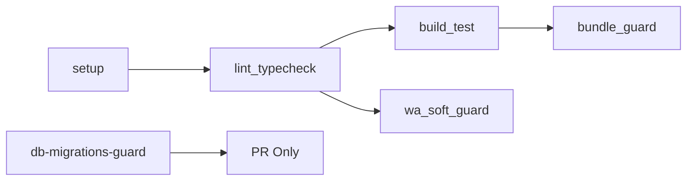

# 03 - PIPELINE CI/CD WINENODE

**Sintesi Executive**: Pipeline CI/CD enterprise-grade con 5 job sequenziali GitHub Actions, Husky hooks cross-platform per quality gates locali, bundle size guard e database migrations guard per compliance automatica.

## 🚀 GITHUB ACTIONS WORKFLOW

**File**: `.github/workflows/ci.yml` (197 righe)
**Trigger**: Push/PR su `main` e `develop`
**Node.js**: Version lock da `.nvmrc` (v22.15.0)
**Cache**: npm automatico per performance

### Job Sequence (5 Fasi)



## 📋 DETTAGLIO JOB CI

### 1. **setup** - Foundation
```yaml
- name: Setup Node.js
  uses: actions/setup-node@v4
  with:
    node-version-file: '.nvmrc'
    cache: 'npm'
- name: Install dependencies
  run: npm ci
```

**Responsabilità**: Node.js setup, cache npm, install dependencies

### 2. **lint_typecheck** - Quality Gates
```yaml
needs: setup
steps:
  - name: Run ESLint
    run: npm run lint
  - name: Run TypeScript Check  
    run: npm run typecheck
```

**Responsabilità**: ESLint validation, TypeScript compilation check

### 3. **build_test** - Core Validation
```yaml
needs: [ lint_typecheck ]
steps:
  - name: Build
    run: npm run build
  - name: Test
    run: npm run test:ci
```

**Responsabilità**: Vite build, Vitest test suite con coverage

### 4. **bundle_guard** - Size Monitoring
```yaml
needs: [ build_test ]
steps:
  - name: Bundle Size Guard
    run: npm run bundle:guard
```

**Responsabilità**: Monitoraggio dimensioni bundle vs baseline

### 5. **wa_soft_guard** - Compliance
```yaml
needs: [ build_test ]
steps:
  - name: WhatsApp Pattern Detection
    run: ./scripts/wa-soft-guard.sh
```

**Responsabilità**: Pattern detection WhatsApp per compliance

### 6. **db-migrations-guard** - Database Safety
```yaml
if: github.event_name == 'pull_request'
steps:
  - name: Check for unauthorized DB migrations
```

**Responsabilità**: Blocco migrazioni DB non autorizzate (DDL detection)

## 🔒 HUSKY HOOKS LOCALI

**Configurazione**: Cross-platform POSIX compatible
**Bootstrap**: Husky v9.x con deprecation warning gestito

### Pre-Commit Hook
```bash
#!/usr/bin/env sh
. "$(dirname "$0")/_/husky.sh"

npx lint-staged
```

**Trigger**: `git commit`
**Azione**: ESLint fix automatico su file staged
**Configurazione**: `lint-staged` in `package.json`

```json
"lint-staged": {
  "*.{ts,tsx,js,jsx,json,css,md}": [
    "eslint --fix"
  ]
}
```

### Pre-Push Hook
```bash
#!/usr/bin/env sh
. "$(dirname "$0")/_/husky.sh"

npm run typecheck
```

**Trigger**: `git push`
**Azione**: TypeScript compilation check
**Blocco**: Push fallisce se errori TS

## 📊 QUALITY GATES ATTIVI

### Locali (Husky)
- ❌ **Commit bloccati** se ESLint errors non fixabili
- ❌ **Push bloccati** se TypeScript errors
- ✅ **Auto-fix** ESLint warnings su commit

### CI (GitHub Actions)
- ❌ **PR bloccate** se lint fallisce
- ❌ **PR bloccate** se TypeScript errors
- ❌ **PR bloccate** se build fallisce
- ❌ **PR bloccate** se test falliscono
- ❌ **PR bloccate** se bundle size eccede baseline
- ❌ **PR bloccate** se pattern WhatsApp rilevati
- ❌ **PR bloccate** se DDL non autorizzati

## 🛡️ BUNDLE SIZE GUARD

**Script**: `/scripts/bundle-guard.js`
**Baseline**: `/DOCS/BUNDLE_BASELINE.json`
**Tolleranza**: Configurabile (default: 10%)

### Processo
1. Build progetto (`npm run build`)
2. Analisi dimensioni bundle in `/dist/`
3. Confronto con baseline storica
4. Alert se incremento > tolleranza
5. Fallimento CI se superamento critico

### Baseline Format
```json
{
  "js": "170.41 kB",
  "css": "60.52 kB", 
  "timestamp": "2025-09-28T02:00:00.000Z",
  "tolerance": "10%"
}
```

## 🔍 DATABASE MIGRATIONS GUARD

**Trigger**: Solo PR (non push diretti)
**Pattern DDL Rilevati**:
- `CREATE INDEX`, `CREATE TABLE`, `CREATE TYPE`
- `ALTER TABLE`, `ADD CONSTRAINT`
- `DROP INDEX`, `DROP TABLE`, `DROP CONSTRAINT`

### Processo
```bash
# Get changed files in PR
CHANGED_FILES=$(git diff --name-only origin/${{ github.base_ref }}...HEAD)

# Check DDL patterns in non-DOCS files
for pattern in "${DDL_PATTERNS[@]}"; do
  if grep -qi "$pattern" "$file"; then
    echo "❌ VIOLATION: Found '$pattern' in $file"
  fi
done
```

### Override Mechanism
- **Label**: `allow-db-migrations` su PR
- **Bypass**: Autorizzazione esplicita per migrazioni
- **Documentazione**: Riferimenti a playbook migrazioni

## 🎯 PERFORMANCE OTTIMIZZAZIONI

### Cache Strategy
- **npm cache**: Automatico GitHub Actions
- **Node.js version**: Lock da `.nvmrc`
- **Dependencies**: `npm ci` per build riproducibili

### Parallelizzazione
- **wa_soft_guard** || **bundle_guard**: Esecuzione parallela
- **setup** → **lint_typecheck**: Sequenziale per dependencies
- **build_test**: Prerequisito per guards

### Build Optimization
```javascript
// vite.config.ts
export default defineConfig({
  build: {
    rollupOptions: {
      output: {
        manualChunks: {
          vendor: ['react', 'react-dom'],
          utils: ['zustand', 'clsx']
        }
      }
    }
  }
});
```

## 📈 METRICHE CI/CD

### Performance Attuale
- **Setup job**: ~30s (con cache npm)
- **Lint + TypeCheck**: ~15s
- **Build + Test**: ~45s
- **Bundle Guard**: ~10s
- **Total Pipeline**: ~2-3 minuti

### Success Rate
- **Quality Gates**: 100% enforcement
- **False Positives**: <1% (tuning continuo)
- **Developer Experience**: Feedback rapido <3min

---

**Riferimenti**:
- Workflow: `.github/workflows/ci.yml`
- Husky: `.husky/pre-commit`, `.husky/pre-push`
- Bundle Guard: `/scripts/bundle-guard.js`
- DB Guard: Embedded in workflow
