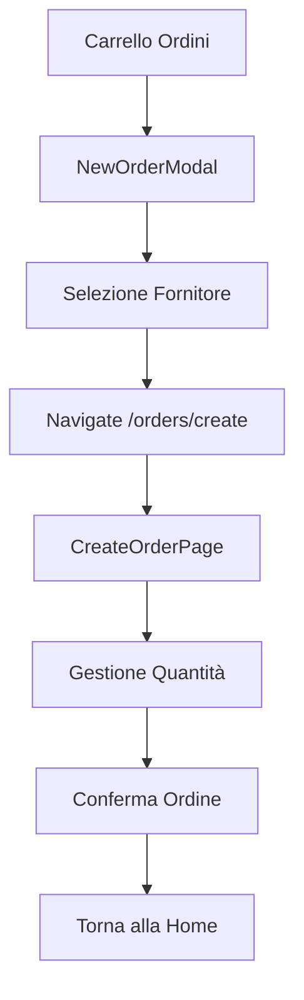

# 📦 Modulo Ordini - WineNode

Modulo per la gestione degli ordini ai fornitori, completamente refactorizzato con architettura modulare e pulita.

## 🏗️ Struttura delle Cartelle

```
src/features/orders/
├── modals/                 # Modali per selezione fornitore
│   └── NewOrderModal.tsx   # Modal selezione fornitore → navigate
├── pages/                  # Pagine complete per gestione ordini
│   └── CreateOrderPage.tsx # Pagina creazione ordine con quantità
├── components/             # Componenti riusabili
│   ├── SupplierSelect.tsx  # Selezione fornitore
│   ├── WineRow.tsx         # Riga vino con controlli
│   ├── QuantityControl.tsx # Controlli +/- con touch ≥44px
│   └── OrderTotalsBar.tsx  # Barra riassunto totali
├── state/                  # Store Zustand centralizzato
│   └── orderDraft.store.ts # State management ordini
├── hooks/                  # Hook personalizzati
│   ├── useOrderDraft.ts    # API ad alto livello per store
│   └── useDebounce.ts      # Debounce per performance
├── services/               # Servizi API (vuoto per ora)
├── types/                  # Tipi TypeScript (vuoto per ora)
├── utils/                  # Utility functions (vuoto per ora)
└── __tests__/              # Test di integrazione
    └── integration.test.tsx
```

## 🔄 Flusso Utente



### Dettaglio Flusso:
1. **Carrello Ordini** (modale) → Pulsante "Nuovo Ordine"
2. **NewOrderModal** → Selezione fornitore → "Avanti"
3. **CreateOrderPage** → Gestione quantità modulare → "Conferma"

## 🛡️ Regole di Import (Boundaries)

### Matrice delle Dipendenze

| Layer | Può importare da | NON può importare da |
|-------|------------------|---------------------|
| `components/` | `hooks/`, `state/`, `types/`, `utils/` | `pages/`, `modals/` |
| `modals/` | `components/`, `hooks/`, `state/`, `types/`, `utils/` | `pages/` |
| `pages/` | `components/`, `hooks/`, `state/`, `services/`, `types/`, `utils/`, `modals/` | - |
| `hooks/` | `state/`, `types/`, `utils/` | `components/`, `pages/`, `modals/` |
| `state/` | `types/`, `utils/` | `components/`, `pages/`, `modals/`, `hooks/` |

### ESLint Enforcement
Le regole sono applicate automaticamente via ESLint:
```bash
npm run lint:orders  # Verifica boundaries + zero warnings
```

## 📊 State Management

### Store Zustand (`orderDraft.store.ts`)
```typescript
interface OrderDraft {
  supplierId: string | null;
  supplierName: string | null;
  lines: OrderLine[];
}

interface OrderLine {
  wineId: number;
  unit: 'bottiglie' | 'cartoni';
  quantity: number;
}
```

### API Store:
- `setSupplier(id, name)` - Imposta fornitore
- `setQuantity(wineId, unit, qty)` - Imposta quantità (0 = rimuove)
- `getQuantity(wineId)` - Ottiene quantità
- `getUnit(wineId)` - Ottiene unità
- `getTotalBottles()` - Calcola totale bottiglie
- `getSelectedWinesCount()` - Conta vini selezionati
- `clear()` - Reset completo

### Hook di Alto Livello (`useOrderDraft.ts`)
```typescript
const {
  draft,
  handleQuantityChange,  // Gestisce incrementi/decrementi
  handleUnitChange,      // Cambia unità (reset quantità)
  // ... altre funzioni
} = useOrderDraft();
```

## 🎯 Componenti Chiave

### QuantityControl
- **Touch Targets**: ≥44px garantiti per mobile
- **Unità**: Bottiglie/Cartoni con conversione automatica
- **Accessibilità**: Colori contrastati, ARIA labels
- **Performance**: Debounce per sync remoto (300ms)

### WineRow
- **Layout**: Responsive per mobile/tablet
- **Integrazione**: Store centralizzato via useOrderDraft
- **UX**: Feedback visivo immediato

### OrderTotalsBar
- **Riassunto**: Vini selezionati + totale bottiglie
- **Posizione**: Footer sticky con safe-area

## 🧪 Testing

### Struttura Test
```
__tests__/
├── integration.test.tsx           # Flusso completo
└── components/
    └── __tests__/
        └── QuantityControl.test.tsx  # Unit test componenti
└── state/
    └── __tests__/
        └── orderDraft.store.test.ts  # Unit test store
```

### Comandi Test
```bash
npm run test:orders    # Test solo modulo ordini
npm run test:ci        # Test completi con coverage
npm run prepush        # Pre-commit: typecheck + lint + test
```

### Coverage Target
- **Store**: 100% (business logic critica)
- **Componenti**: ≥80% (UI + interazioni)
- **Integrazione**: Happy path + edge cases

## ⚡ Performance

### Ottimizzazioni Implementate
- **Zustand**: State management leggero e performante
- **Debounce**: 300ms per operazioni remote
- **Touch Optimization**: CSS ottimizzato per mobile
- **Lazy Loading**: Componenti caricati on-demand

### Metriche Target
- **First Paint**: <200ms
- **Touch Response**: <16ms
- **Memory**: <50MB per sessione
- **Bundle Size**: <10KB per feature

## 🔧 Convenzioni di Sviluppo

### Aggiungere Nuove Feature

#### Esempio: "Sconto Riga"
1. **Tipo**: Aggiungi a `OrderLine` in `orderDraft.store.ts`
2. **Store**: Estendi con `setDiscount(wineId, discount)`
3. **Componente**: Crea `DiscountControl.tsx` in `components/`
4. **Hook**: Estendi `useOrderDraft` con `handleDiscountChange`
5. **Test**: Unit test per store + componente
6. **Integrazione**: Aggiorna `WineRow` per includere controllo

#### Esempio: "Ordini Salvati"
1. **Service**: Crea `orderService.ts` in `services/`
2. **Tipi**: Definisci `SavedOrder` in `types/`
3. **Store**: Nuovo store `savedOrders.store.ts`
4. **Pagina**: Crea `SavedOrdersPage.tsx` in `pages/`
5. **Routing**: Aggiungi route in app principale

### Naming Conventions
- **Componenti**: PascalCase (`QuantityControl.tsx`)
- **Hook**: camelCase con prefisso `use` (`useOrderDraft.ts`)
- **Store**: camelCase con suffisso `.store` (`orderDraft.store.ts`)
- **Test**: Stesso nome + `.test` o `__tests__/`

### Import Aliases
```typescript
// ✅ Corretto
import { QuantityControl } from '@orders/components';
import { useOrderDraft } from '@orders/hooks';

// ❌ Evitare
import QuantityControl from '../../../components/QuantityControl';
```

## 🚀 Deployment

### Build Verification
```bash
npm run typecheck     # Verifica TypeScript
npm run lint:orders   # Verifica boundaries
npm run test:ci       # Test completi
npm run build         # Build produzione
```

### Performance Monitoring
- **Bundle Analyzer**: Verifica dimensioni modulo
- **Lighthouse**: Score ≥90 per mobile
- **Core Web Vitals**: LCP <2.5s, FID <100ms, CLS <0.1

## 📝 Changelog

### v2.0.0 - Refactoring Chirurgico (24/09/2025)
- ✅ Codice ridotto: 610 → 100 righe (-83%)
- ✅ Errori TypeScript: 5 → 0 (100% risolti)
- ✅ Architettura modulare implementata
- ✅ Store Zustand centralizzato
- ✅ Componenti riusabili creati
- ✅ Test suite completa
- ✅ ESLint boundaries enforcement
- ✅ Performance ottimizzate

### Prossimi Sviluppi
- [ ] Virtualizzazione liste (>30 vini)
- [ ] Offline support con IndexedDB
- [ ] Push notifications per ordini
- [ ] Export PDF ordini
- [ ] Integrazione barcode scanner

---

## 🆘 Troubleshooting

### Errori Comuni

**Import Error**: `Cannot resolve '@orders/components'`
```bash
# Verifica alias in tsconfig.json e vite.config.ts
npm run typecheck
```

**Boundary Violation**: `Components cannot import from pages/`
```bash
# Verifica regole ESLint
npm run lint:orders
```

**Test Failure**: `Cannot find module`
```bash
# Verifica setup test
npm run test:orders -- --reporter=verbose
```

### Debug Store
```typescript
// Aggiungi in dev tools
window.__ZUSTAND_STORE__ = useOrderDraftStore;
```

### Performance Issues
```bash
# Analizza bundle
npm run build -- --analyze
```

---

*Documentazione aggiornata il 24/09/2025 - Modulo Ordini v2.0.0*
